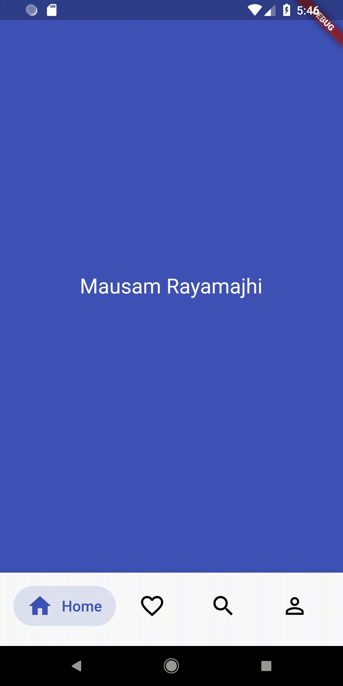

# Flutter UI Challenges
My effort on replicating various apps UI on flutter.

## What's Going On
- Custome bottom navigation bar is implemented
- Animation is added when each icon is bar when tap on it
- Icon name is revealed when tap on icon

## Credit
Idea is taken from (https://dribbble.com/shots/5925052-Google-Bottom-Bar-Navigation-Pattern)

## For More UI Challanges 
Visit (https://www.mausamrayamajhi.com.np/)

## Ecommerce
       